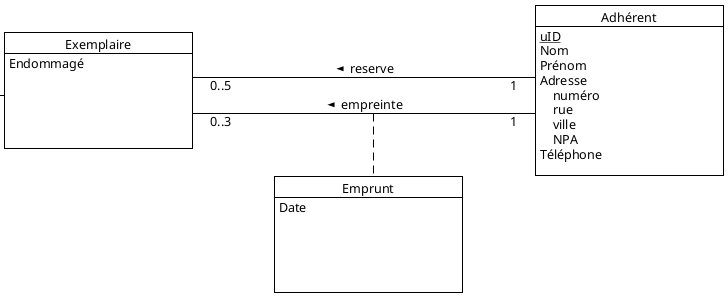

# BDR - Laboratoire n⁰ 1

Par Timothée Van Hove et Thomas Germano

### Exercice 2.2

### Exercice 2.3

#### 2.3.1

##### 2.3.1.1

`Les livres ont un titre, un auteur et un genre (roman, manuel, dictionnaire, image, référence, BD).`

##### 2.3.1.2

`Il existe plusieurs exemplaires physiques pour un livre. Les exemplaires sont numérotés par des numéros 1, 2, etc, pour identifier le 1er exemplaire, le 2ème exemplaire, etc.`

##### 2.3.1.3

`Pour chaque exemplaire, on aimerait savoir s’il est endommagé (si c’est le cas, alors il ne pourra plus être loué mais seulement consulté sur place).`

##### 2.3.1.4

`Chaque livre a un numéro ISBN et un éditeur. Les adhérents ont un code unique, un nom, un prénom, une adresse complète (numéro, rue, ville, NPA) et un téléphone.`

##### 2.3.1.5

`On souhaite archiver tous les emprunts. La durée maximale d’un emprunt est de 21 jours. Un adhérent ne peut emprunter plus de 3 livres en même temps. Chaque adhérent peut aussi réserver au maximum 5 livres en même temps.`

##### Résultat final

#### 2.3.2

`La bibliothèque souhaite pouvoir connaître à tout moment la situation de chaque adhérent (nombre de livres empruntés, retards éventuels). Elle souhaite aussi pouvoir faire des statistiques sur la pratique des adhérents (nombre de livres empruntés par année, répartition des emprunts par genre et nombre d’emprunts par livre).`

`Indiquez s’il est possible de répondre à ces demandes à l’aide de votre schéma en justifiant votre réponse, et si ce n’est pas le cas comment le modifier ?`

Dans l'état actuelle de notre schéma, il n'est pas possible d'avoir un historique des emprunts, pour cela il faudrait modifier le schéma comme ci-dessous :

De cette manière, nous avons un historique des emprunts de tous les adhérents.

##### Résultat final

### Exercice 2.4

### Exercice 2.5

### Exercice 2.6